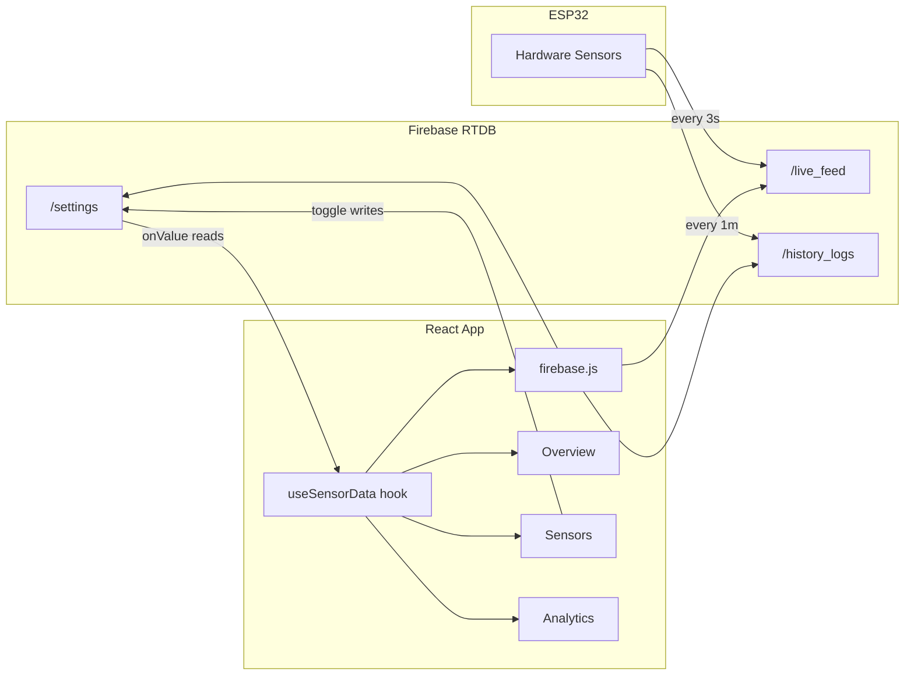

# Firebase RTDB Integration — Eco Grow Automation

Connect the existing React dashboard to Firebase Realtime Database with a **Dual-Stream** architecture: real-time live feed + historical log ingestion, bidirectional sensor controls, anonymous auth, and a built-in Demo Mode fallback.

## Architecture Overview

---

## Proposed Changes

### Firebase Utility

#### [NEW] [firebase.js](file:///c:/Users/JOY%20BHATTACHARJEE/Eco%20grow%20automation/src/firebase.js)

Creates a single shared Firebase instance:

- `initializeApp(firebaseConfig)` with the provided config object
- `getDatabase()` → export `db`
- `getAuth()` + `signInAnonymously(auth)` called at import-time (returns a promise; the hook awaits it)
- Export helper refs: `liveFeedRef`, `historyLogsRef`, `settingsRef`
- Export utility: `getSettingRef(key)` for per-sensor toggle paths

---

### Sensor Data Hook (Core Logic)

#### [MODIFY] [useSensorData.jsx](file:///c:/Users/JOY%20BHATTACHARJEE/Eco%20grow%20automation/src/hooks/useSensorData.jsx)

This is the **heart** of the integration. The current hook is 100% mock data; it will be rewritten to support two modes selected via a `demoMode` state toggle:

**Mode 1 — Firebase Live (default)**
| Concern | Implementation |
|---|---|
| Auth gate | `useEffect` awaits `signInAnonymously` once on mount |
| Live feed | `onValue(liveFeedRef)` → maps `{temp, hum, moist, sun, air, rain, water_level, co2, no2}` → internal `sensorData` state using the existing key names (`temperature`, `humidity`, `soilMoisture`, `sunlight`, `airQuality`, `rainfall`, `waterLevel`, `co2`, `no2`) |
| History bootstrap | On mount, `query(historyLogsRef, limitToLast(100))` → populates `historicalData` arrays |
| Live FIFO append | Every new `/live_feed` snapshot also `push`es each value onto the corresponding `historicalData` array, capped at **50 points** via `.slice(-50)` |
| Settings read | `onValue(settingsRef)` → syncs `sensorStates` from RTDB |
| Settings write | `toggleSensor(id)` and `toggleWaterPump()` call `set(ref(db, 'settings/…'), newValue)` |
| Connection status | `onValue(ref(db, '.info/connected'))` → `isConnected` state |
| Cleanup | All `onValue` listeners are unsubscribed in the effect's cleanup |

**Mode 2 — Demo Mode**
- Keeps the existing `setInterval` + `fluctuate()` mock engine (current code)
- `demoMode` boolean toggled via exported `toggleDemoMode()` function
- Exposed in the context so the UI can show a toggle

**Key-mapping contract** (Firebase JSON → React state):

| Firebase key | React state key |
|---|---|
| `temp` | `temperature` |
| `hum` | `humidity` |
| `moist` | `soilMoisture` |
| `sun` | `sunlight` |
| `air` | `airQuality` |
| `rain` | `rainfall` |
| `water_level` | `waterLevel` |
| `co2` | `co2` |
| `no2` | `no2` |

**Sensor toggle → RTDB path mapping:**

| `sensorStates` key | RTDB path |
|---|---|
| `waterPump` | `settings/water_pump` |
| `waterLevel` | `settings/water_level_sensor` |
| `ldrSensor` | `settings/ldr_sensor` |
| `airQuality` | `settings/air_quality_sensor` |
| `temperature` | `settings/temp_sensor` |
| `moisture` | `settings/moisture_sensor` |
| `rainfall` | `settings/rainfall_sensor` |

**New context values exported:**
- `demoMode` (boolean)
- `toggleDemoMode()` (function)

---

### UI Components (Minimal Changes)

#### [MODIFY] [App.jsx](file:///c:/Users/JOY%20BHATTACHARJEE/Eco%20grow%20automation/src/App.jsx)

- Add a small **Demo Mode toggle** button in the sidebar (below the nav tabs), wired to `toggleDemoMode()` from context. Styled as a subtle pill/switch.
- No other layout or styling changes.

#### [NO CHANGE] [Overview.jsx](file:///c:/Users/JOY%20BHATTACHARJEE/Eco%20grow%20automation/src/components/Overview.jsx)

Already consumes `formattedData`, `sensorStates`, `toggleWaterPump`, `notifications`, `historicalData`, `lastUpdated` from context — no code changes needed. The hook rewrite provides the same interface.

#### [NO CHANGE] [Sensors.jsx](file:///c:/Users/JOY%20BHATTACHARJEE/Eco%20grow%20automation/src/components/Sensors.jsx)

Already consumes `sensorStates`, `toggleSensor`, `formattedData`, `isConnected` from context — no code changes needed. Toggle writes will flow through the rewritten hook.

#### [NO CHANGE] [Analytics.jsx](file:///c:/Users/JOY%20BHATTACHARJEE/Eco%20grow%20automation/src/components/Analytics.jsx)

Already consumes `formattedData`, `historicalData`, `lastUpdated` from context — no code changes needed. FIFO-buffered arrays will flow through automatically.

---

## User Review Required

> [!IMPORTANT]
> **Your Firebase API key is included in the config.** This is normal for client-side Firebase (security relies on RTDB rules + auth, not the API key), but please confirm your RTDB rules require `auth != null` so anonymous auth gates access.

> [!WARNING]
> **The demo mode toggle will be visible in the sidebar.** If you'd prefer it hidden behind a keyboard shortcut or placed elsewhere, let me know.

## Open Questions

1. **Demo Mode default:** Should the app start in **Demo Mode** (offline-first, no Firebase connection until toggled) or **Firebase Live** (connects immediately, falls back to demo if auth fails)? I'm planning **Firebase Live by default** with auto-fallback.

2. **Settings initialization:** If the `/settings` node doesn't exist yet in RTDB, should the app write default values (all sensors `true`) on first connect? I'm planning **yes**.

---

## Verification Plan

### Automated Tests
- `npm run build` — ensure no compilation errors
- `npm run dev` — confirm hot-reload works

### Manual Verification (Browser)
1. Open the app → verify anonymous auth succeeds (check browser console)
2. Toggle **Demo Mode** ON → verify gauges fluctuate every 3s
3. Toggle **Demo Mode** OFF → verify Firebase connection and live data (or fallback message if no hardware is pushing data)
4. Go to **Sensors** tab → toggle each switch → verify writes appear in Firebase Console under `/settings`
5. Go to **Analytics** tab → verify charts populate with historical data and FIFO-buffer new points
6. Check **Overview** → verify donut charts, water level, and notifications update in real-time
